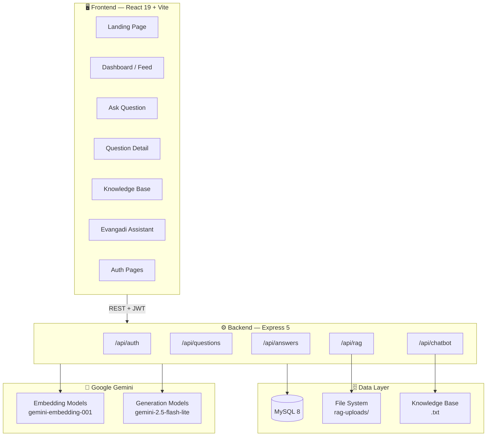
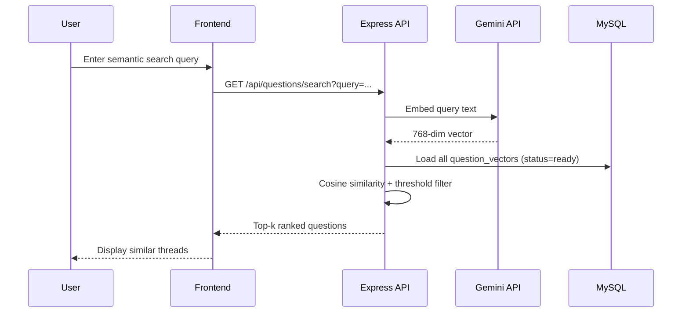
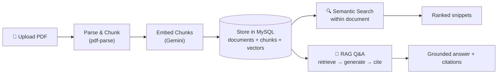
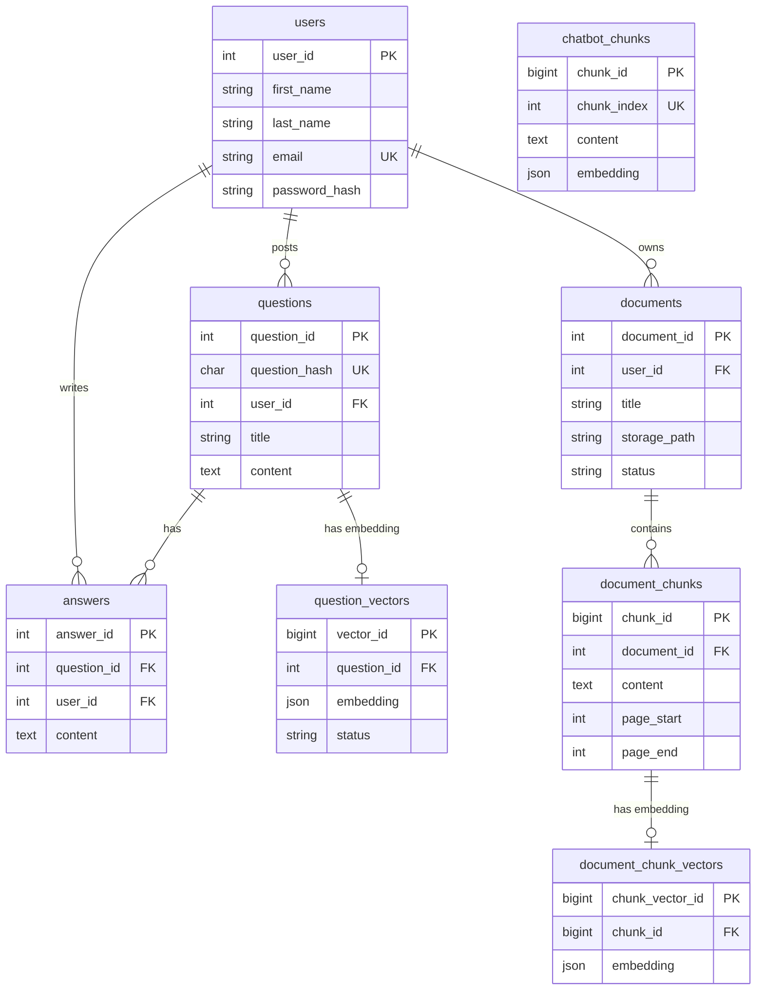

<div align="center">

# 🧠 Evangadi Forum

### *Learn together. Ask with context.*

[](https://react.dev/)
[](https://expressjs.com/)
[](https://www.mysql.com/)
[](https://ai.google.dev/)
[](https://vitejs.dev/)

**A full-stack, AI-powered technical Q&A forum built for Evangadi Networks learners and mentors.**

[Features](#-features) · [Architecture](#-architecture) · [Getting Started](#-getting-started) · [API Reference](#-api-reference) · [Design System](#-design-system)

</div>

---

## 📖 Overview

**Evangadi Forum** is a modern learning platform that combines peer-to-peer technical Q&A with intelligent AI assistance. Learners can post structured questions, receive markdown-rich answers, search the archive by keyword or semantic meaning, upload course PDFs for retrieval-augmented generation (RAG), and chat with an official Evangadi knowledge-base assistant — all in one calm, focused workspace.

> **Tagline:** *A calm place for technical Q&A — with enough context for peers to help in one pass.*

### Why this project?

| Challenge | Solution |
|-----------|----------|
| Duplicate questions across a cohort | **Semantic search** finds similar threads by meaning, not just keywords |
| Vague or incomplete posts | **AI draft coach** suggests improvements before publishing |
| Answers that miss the point | **Answer-fit check** scores draft relevance before posting |
| Generic AI hallucinations | **RAG pipeline** grounds answers in uploaded course materials with citations |
| Scattered program information | **Evangadi Assistant** answers from an official, ingested knowledge base |

---

## ✨ Features

### 🔐 Authentication & User Management
- JWT-based register / login with bcrypt password hashing
- Protected routes with automatic 401 redirect
- Per-user ownership for questions, answers, and documents

### 💬 Forum & Threads
- Post questions with markdown support (title, context, code blocks)
- Hash-based shareable URLs (`/questions/:questionHash`)
- Threaded replies with full markdown rendering
- **Your Topics** — filter to questions you've authored

### 🔍 Dual Search Modes
- **Keyword search** — SQL `LIKE` + MySQL `FULLTEXT` on title and content
- **Semantic search** — Gemini embeddings + cosine similarity across all question vectors

### 🤖 AI-Powered Helpers
| Feature | Endpoint | What it does |
|---------|----------|--------------|
| **Draft Coach** | `POST /api/questions/draft-coach` | 3–5 actionable tips to improve a question draft |
| **Answer Fit** | `POST /api/questions/:hash/answer-fit` | Rates draft relevance (`strong` / `partial` / `weak`) |
| **Similar Questions** | `GET /api/questions/:hash/similar` | Surfaces related threads on the detail page |

### 📚 Knowledge Base (RAG)
- Upload personal PDFs (max 5 MB) — parsed, chunked, and embedded
- Semantic search within a single document
- AI Q&A grounded in retrieved chunks with numbered citations
- In-browser PDF preview and per-user document library

### 🗣️ Evangadi Assistant (Chatbot)
- Chat interface backed by the official **Evangadi Networks Knowledge Base**
- Retrieval-augmented responses with conversation history (up to 20 turns)
- Citation-backed answers — no open-web guessing
- One-time knowledge-base ingestion via `POST /api/chatbot/ingest`

---

## 🏗 Architecture

### High-Level System Diagram



### Request Flow — Semantic Search



### RAG Pipeline



### Backend Pattern

```
routes → controller → service → repository / SQL
         ↑
    express-validator (input validation)
    authentication.js (JWT middleware)
```

---

## 🛠 Tech Stack

### Frontend
| Technology | Purpose |
|------------|---------|
| **React 19** | UI framework |
| **Vite 8** | Build tool & dev server |
| **React Router 7** | Client-side routing |
| **Axios** | HTTP client with JWT interceptors |
| **Framer Motion** | Landing page animations |
| **Lucide React** | Icon system |
| **react-markdown** | Markdown rendering in threads |
| **CSS Modules** | Scoped, component-level styling |
| **Vitest** | Unit testing (configured) |

### Backend
| Technology | Purpose |
|------------|---------|
| **Express 5** | REST API server |
| **MySQL 2** | Relational database + connection pool |
| **jsonwebtoken** | JWT authentication |
| **bcryptjs** | Password hashing |
| **express-validator** | Request validation |
| **Multer** | PDF file uploads |
| **pdf-parse** | PDF text extraction |
| **@google/genai** | Gemini embeddings & text generation |

### AI / ML
| Model | Used For |
|-------|----------|
| `gemini-embedding-001` | Question & document chunk embeddings (768-dim) |
| `text-embedding-004` | Chatbot knowledge-base embeddings |
| `gemini-2.5-flash-lite` | Draft coach, answer fit, RAG Q&A |
| `gemini-2.0-flash-lite` | Chatbot conversation generation |

> Vectors are stored as MySQL `JSON` columns. Similarity is computed in Node.js via cosine similarity — no dedicated vector database required.

---

## 📁 Project Structure

```
AI_Powered_Forum/
│
├── 📂 backend/
│   ├── index.js                          # Express entry point
│   ├── db/
│   │   ├── db.config.js                  # MySQL pool + safeExecute()
│   │   └── schema.sql                    # Database DDL
│   ├── rag-uploads/                      # User PDF storage (per-user dirs)
│   └── src/
│       ├── api/
│       │   ├── routes.js                 # Route aggregator
│       │   ├── auth/                     # Register & login
│       │   ├── question/                 # CRUD + semantic search + AI coach
│       │   ├── answer/                   # CRUD answers
│       │   ├── rag/                      # PDF upload, search, RAG Q&A
│       │   └── chatbot/                  # KB ingest + chat assistant
│       ├── middleware/                   # Auth, validation, error handling, upload
│       └── utils/errors/                 # Typed HTTP error classes
│
├── 📂 frontend/
│   └── src/
│       ├── App.jsx                       # Route map
│       ├── contexts/AuthContext.jsx      # Global auth state
│       ├── components/                   # Layout, Sidebar, Navbar, cards…
│       ├── pages/                        # Landing, Dashboard, ChatBot, RAG…
│       ├── services/                     # Axios API clients per domain
│       ├── index.css                     # Global design tokens
│       └── styles/pageStates.module.css  # Shared loading/empty states
│
└── README.md
```

### Frontend Routes

| Path | Page | Access |
|------|------|--------|
| `/` | Landing (marketing) | Public |
| `/auth` | Login / Register | Public |
| `/dashboard` | Home feed + search | Protected |
| `/questions/ask` | Post a question + AI coach | Protected |
| `/questions/:hash` | Thread detail + similar topics | Protected |
| `/my-questions` | Your authored topics | Protected |
| `/rag-documents` | Knowledge base (PDF RAG) | Protected |
| `/chatbot` | Evangadi Assistant | Protected |

---

## 🚀 Getting Started

### Prerequisites

- **Node.js** 18+ (ES modules)
- **MySQL** 8+
- **Google Gemini API key** — [Get one here](https://aistudio.google.com/apikey)

### 1. Clone the repository

```bash
git clone <repository-url>
cd AI_Powered_Forum
```

### 2. Set up the database

```bash
mysql -u <your-mysql-user> -p < backend/db/schema.sql
```

Then create the chatbot table (required for the Evangadi Assistant):

```sql
CREATE TABLE chatbot_chunks (
    chunk_id    BIGINT AUTO_INCREMENT PRIMARY KEY,
    chunk_index INT NOT NULL UNIQUE,
    content     TEXT NOT NULL,
    embedding   JSON NOT NULL
) ENGINE=InnoDB DEFAULT CHARSET=utf8mb4 COLLATE=utf8mb4_unicode_ci;
```

### 3. Configure environment variables

> 🔒 **Never commit `.env` files.** Copy the templates below into local `.env` files only. Use strong, unique values for secrets — the examples are placeholders, not real credentials.

**`backend/.env`** (create locally; do not commit)

```env
PORT=5000
DB_HOST=<your-db-host>
DB_USER=<your-db-user>
DB_PASSWORD=<your-db-password>
DB_NAME=<your-db-name>

JWT_SECRET=<generate-a-long-random-secret>
JWT_EXPIRES_IN=1d

GEMINI_API_KEY=<your-gemini-api-key>
GEMINI_EMBEDDING_MODEL=gemini-embedding-001
GEMINI_TEXT_MODEL=gemini-2.5-flash-lite

RECOMMEND_THRESHOLD=0.75
RECOMMEND_K=5
```

**`frontend/.env`** (create locally; do not commit)

```env
VITE_API_BASE_URL=http://localhost:<backend-port>
```

> ⚠️ **Port alignment:** The backend defaults to port `5000`, but the frontend API client falls back to `5001`. Set `VITE_API_BASE_URL` explicitly to match your backend `PORT`.

### 4. Install dependencies & run

**Terminal 1 — Backend**

```bash
cd backend
npm install
npm run dev        # nodemon → http://localhost:5000
```

**Terminal 2 — Frontend**

```bash
cd frontend
npm install
npm run dev        # Vite → http://localhost:5173
```

### 5. Ingest the chatbot knowledge base

After registering and logging in, trigger a one-time ingestion:

```bash
curl -X POST http://localhost:<backend-port>/api/chatbot/ingest \
  -H "Authorization: Bearer <your-jwt-token>"
```

Verify readiness:

```bash
curl http://localhost:<backend-port>/api/chatbot/status \
  -H "Authorization: Bearer <your-jwt-token>"
```

> 🔒 In production, restrict `/api/chatbot/ingest` to trusted operators only. It rewrites the shared knowledge-base index and should not be callable by every authenticated user.

---

## 📡 API Reference

Base URL (local development): `http://localhost:<backend-port>/api`

### Health Check

| Method | Endpoint | Auth | Description |
|--------|----------|------|-------------|
| `GET` | `/health` | — | Server health status |

### Auth — `/api/auth`

| Method | Endpoint | Auth | Description |
|--------|----------|------|-------------|
| `POST` | `/register` | — | Create a new account |
| `POST` | `/login` | — | Authenticate and receive JWT |

### Questions — `/api/questions`

| Method | Endpoint | Auth | Description |
|--------|----------|------|-------------|
| `POST` | `/` | ✅ | Create a question (auto-embeds title) |
| `GET` | `/` | ✅ | List questions (`?search=`, `?mine=true`) |
| `GET` | `/search` | ✅ | Semantic search (`?query=`, `?k=`, `?threshold=`) |
| `POST` | `/draft-coach` | ✅ | AI tips for improving a draft |
| `GET` | `/:questionHash` | ✅ | Single question + all answers |
| `GET` | `/:questionHash/similar` | ✅ | Similar questions by vector |
| `POST` | `/:questionHash/answer-fit` | ✅ | AI relevance check on answer draft |

### Answers — `/api/answers`

| Method | Endpoint | Auth | Description |
|--------|----------|------|-------------|
| `POST` | `/` | ✅ | Post an answer |
| `GET` | `/:answerId` | — | Fetch a single answer |
| `PATCH` | `/:answerId` | ✅ | Update own answer |
| `DELETE` | `/:answerId` | ✅ | Delete own answer |

### RAG — `/api/rag`

| Method | Endpoint | Auth | Description |
|--------|----------|------|-------------|
| `POST` | `/documents` | ✅ | Upload PDF (`multipart/form-data`) |
| `GET` | `/documents` | ✅ | List user's documents |
| `GET` | `/documents/:id` | ✅ | Document metadata |
| `DELETE` | `/documents/:id` | ✅ | Delete document + file + chunks |
| `GET` | `/documents/:id/file` | ✅ | Stream PDF file |
| `GET` | `/documents/:id/search` | ✅ | Semantic search within document |
| `POST` | `/documents/:id/query` | ✅ | RAG Q&A with citations |

### Chatbot — `/api/chatbot`

| Method | Endpoint | Auth | Description |
|--------|----------|------|-------------|
| `POST` | `/ingest` | ✅ | Ingest knowledge base (optional `?force=true`) |
| `GET` | `/status` | ✅ | Check readiness and chunk count |
| `POST` | `/chat` | ✅ | Chat (`{ message, history? }`) |

**Authentication header for protected routes:**

```
Authorization: Bearer <jwt-token>
```

---

## 🗄 Database Schema



---

## 🎨 Design System

The UI follows a **clean, modern aesthetic** — generous whitespace, a restrained slate palette, and a vibrant orange accent. CSS custom properties in `frontend/src/index.css` keep the entire app visually consistent.

### Color Palette

| Token | Value | Usage |
|-------|-------|-------|
| `--primary` | `#f97316` 🟠 | CTAs, focus rings, active navigation |
| `--text-primary` | `#0f172a` | Headings and body text |
| `--background` | `#f8fafc` | Page background |
| `--border` | `#e2e8f0` | Cards, dividers, inputs |
| `--success` | `#10b981` 🟢 | Positive states |
| `--error` | `#ef4444` 🔴 | Error states |
| `--info` | `#3b82f6` 🔵 | Informational badges |

### Layout

```
┌──────────────────────────────────────────────────────┐
│  Sidebar (17rem)  │  Navbar (title + subtitle)       │
│  ───────────────  │  ──────────────────────────────  │
│  🏠 Home          │                                  │
│  💬 Your Topics   │  Main Content Area               │
│  🤖 Assistant     │  (max-width: 80rem)              │
│  📄 Knowledge     │                                  │
│                   │                                  │
│  [New Question]   │  Footer                          │
│  👤 User / Logout │                                  │
└──────────────────────────────────────────────────────┘
```

- **Font:** Inter (with system-ui / `-apple-system` fallback)
- **Icons:** Lucide React
- **Animations:** Framer Motion on the landing hero
- **Styling:** CSS Modules per component — no utility-class framework

---

## 🧪 Testing & Linting

```bash
# Backend — Node.js built-in test runner
cd backend && npm test

# Frontend — Vitest + Testing Library
cd frontend && npm test          # single run
cd frontend && npm run test:watch  # watch mode
cd frontend && npm run lint        # ESLint
```

---

## 📦 Production Build

```bash
# Frontend static build
cd frontend
npm run build        # outputs to frontend/dist/
npm run preview      # local preview of production build

# Backend
cd backend
npm start            # node index.js (no hot reload)
```

### Deployment Notes

| Concern | Recommendation |
|---------|----------------|
| PDF storage | Mount a persistent volume for `backend/rag-uploads/` |
| CORS | Restrict origins in production (currently open) |
| Secrets | Use environment variables — never commit `.env` files |
| Chatbot KB | Run `/api/chatbot/ingest` after each knowledge-base update |
| Gemini API | Monitor rate limits and costs in Google AI Studio |

---

## 🔒 Security

This README documents **local development only**. Before publishing or deploying publicly, review the following:

| Area | Guidance |
|------|----------|
| **Secrets** | Never commit `.env`, API keys, JWT secrets, or database passwords. Use placeholders in docs and real values only in your deployment environment. |
| **Database** | Do not use privileged accounts (e.g. `root`) in production. Create a dedicated application user with least-privilege access. |
| **JWT** | Use a long, randomly generated `JWT_SECRET`. Rotate it if you suspect exposure. |
| **API keys** | Keep `GEMINI_API_KEY` server-side only (backend `.env`). Never expose it in frontend code or `VITE_*` variables. |
| **CORS** | Tighten allowed origins before production; the default setup is permissive for local development. |
| **File uploads** | PDFs are stored on the server filesystem. Validate size limits, scan uploads if required by your policy, and protect `rag-uploads/` from public HTTP access. |
| **Chatbot ingest** | Treat `POST /api/chatbot/ingest` as an administrative action, not a general user feature. |
| **Authentication** | Tokens are stored in browser `localStorage`. For higher-security deployments, consider httpOnly cookies and HTTPS-only transport. |

If you fork this repository, rotate any credentials you used during development before going public.

---

## 🗺 Roadmap & Known Limitations

- [ ] Add `chatbot_chunks` table to `schema.sql` (currently manual SQL step)
- [ ] Create `.env.example` files for both packages
- [ ] Align default ports (backend `5000` vs frontend fallback `5001`)
- [ ] Add Vitest setup file (`src/test/setup.js`) and initial test suites
- [ ] Docker / CI pipeline for automated builds
- [ ] Auto-ingest chatbot KB on server startup (optional flag)
- [ ] Instructor/cohort-level shared document corpora

---

## 🤝 Contributing

1. Fork the repository
2. Create a feature branch: `git checkout -b feature/your-feature`
3. Commit your changes: `git commit -m "Add your feature"`
4. Push to the branch: `git push origin feature/your-feature`
5. Open a Pull Request

Please follow the existing code patterns:
- Backend: `routes → controller → service` with `express-validator`
- Frontend: domain services in `src/services/`, CSS Modules for styling
- Match naming conventions and keep diffs focused

---

## 📄 License

This project is built for **educational use** as part of the Evangadi Networks Full Stack program (Phase 5).

---

<div align="center">

**Built with ❤️ for Evangadi Networks learners**

*Post with context · Search by meaning · Answer with evidence*

</div>
